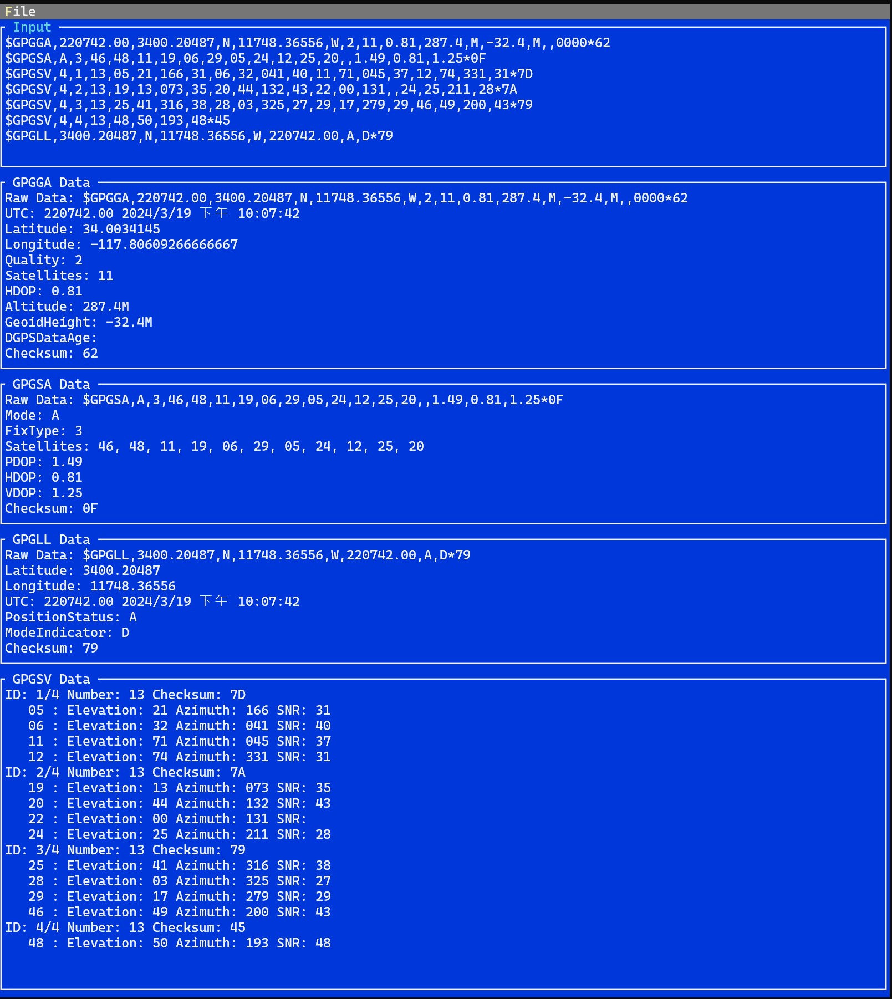

# GPSReader

GPSReader is a C# library designed to parse NMEA 0183 sentences from GPS devices. It provides a flexible and extensible way to handle different types of NMEA sentences.

## Features

- Supports reading NMEA sentences from a serial port(real-time) or a file(simulation purpose).
- Supports multiple NMEA sentence types (GPGGA, GPGSA, GPGLL, GPGSV).
- Event-driven architecture allows for real-time processing of GPS data.
- Customizable parser list allows for easy addition of new sentence types.

## Hardware Requirements
Any GPS device that outputs NMEA 0183 sentences over a serial port should work with GPSReader. You can also use a file containing NMEA sentences for testing purposes.
I bought a GPS module VK-162 and connected it to my computer. You can find it on Amazon or AliExpress.

## Usage

To use GPSReader, you need to create an instance of `GPSReaderService`, passing in an `ILogger`, an `INMEAInput`, and a list of `BaseNMEAParser` objects.

```csharp
var parsers = new List<BaseNMEAParser>
{
    new GPGGAParser(),
    new GPGSAParser(),
    // Add or remove parsers as needed
};

var gpsReaderService = new GPSReaderService(logger, input, parsers);
```

You can then subscribe to the events provided by GPSReaderService to handle the parsed data.

```csharp
gpsReaderService.OnGPGGAUpdated += (sender, args) =>
{
    // Handle GPGGA data
};

gpsReaderService.OnGPGSAUpdated += (sender, args) =>
{
    // Handle GPGSA data
};

// Subscribe to other events as needed
```

## Example
You can find an example of how to use GPSReader in the `ConsoleApp` project under example folder. This project contains a simple console application that reads GPS data from a file and prints the parsed data to the console.

[README.md](README.md)
Screenshot of the example output:


## Contributing
Contributions are welcome! Please feel free to submit a pull request or open an issue if you have any suggestions or bug reports.

## License
GPSReader is licensed under the MIT License.

